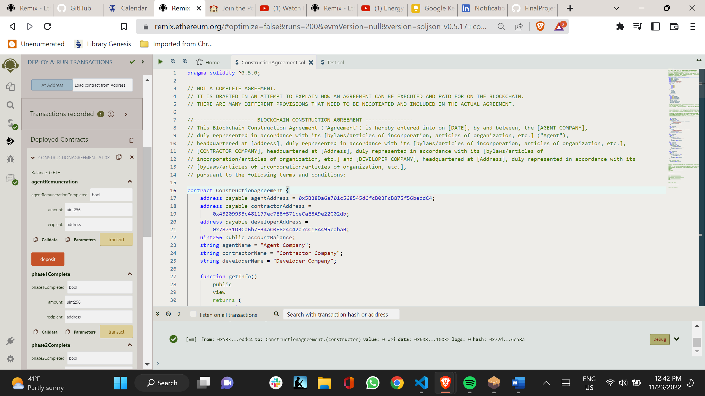

# FinalProject
## Final Project for Columbia Fintech
## Problem Description
As one of the largest industries in the US (and the world), the construction market remains lucrative. Beyond the coronavirus-induced hiccups that hit the industry in early 2020, the US construction industry is constantly changing and adjusting to new economic climates around the globe. Construction statistics from 2020 show that there is not only a lot of growth in the market — but also increased risks.

Today, construction data is an invaluable asset for contractors that can assist them in their decision-making — from preconstruction to collecting payment. 

Payment processes in the construction industry is a focal point of research in recent years.

As published in the 2020 National Construction Payment Report conducted in Quarter 1 of 2020, a survey of over 540 construction professionals found that 80% of construction businesses spend a significant portion of their work week seeking payments for their work. 

Additionally, just 50% of those businesses said they received payment within 30 days of invoicing.

US construction spending totaled $1.3 trillion in 2019.

## Solution and Scope of Project

In this project, we will use Smart Contracts to prevent Counter-Party Risk between Developers and Contractors using Blockchain and Tokenized Payments. 

Our company will house third-party escrow agents who work closely with our in-house attorneys and relationship management team to establish clear communication and facilitate efficient escrow transactions between developers and contractors to avoid Class action/litigation settlements.

We work with issuers and obligors within the construction industry to serve as trustees and paying agents for various transactions.

Paying agent
Collateral agent
Settlement agent
Escrow agent
Custodian
Depositary

### USDC and Smart Contract Description
In order to work within a test environment using USDC several steps had to be undertaken to reach a functional transaction system. The following list may not be exhaustive of all steps taken. As it was very much a trial and order process. 
* Metamask should be installed. The wallets will work through Metamask.
* The wallet needs to be connected to the Mumbai Polygon test network. 
* There must be MATIC in the wallet to pay for gas fees. MATIC can be retrieved from a faucet.
* The account needs to be funded with test USDC by minting on the polygon network.
* The account may need to be approved to spend a certain amount.
* The contract might need to be verified.
* The contract should be compiled and deplyoed correctly using "Injected Provider - Metamask". 
When these steps are taken, it's possible to use the contract to transfer USDC from the main account to the deployed contract and that transaction is recorded on the Polygon test network, and reflected in the respective wallets. 

### CNN Description
The convoluted neural network takes images of Oxford buildings and/or surroundings and is meant to figure out whether or not the image is a building.  This program is meant to eventually become capable of matching blueprints and renderings to current construction projects.  In utilizing this capability, one may be able to act as the auditor and better facilitate payment to the construction company.

It should be noted that there are several files that generate labels for the images (as labeled from their filename) and some that generate the images to a .npy file.  However, the npy files are of the form (a(b,c,d)) where they should be (a,b,c,d) for the CNN.  Thus, the code does not work fully as this bug still needs to be figured out.  It is suggested that the size/number of images should be reduced as difficulty fixing the code had to do with memory issues.

Also, npy files will not be uploaded as they are too big for GitHub!!!!


---

## Technologies

This project leverages solidity (pragma ^0.5.0) for all smart contracts including USDC and Construction Agreements

* [pandas](https://github.com/pandas-dev/pandas) - Flexible and powerful data analysis / manipulation library for Python, providing labeled data structures similar to R data.frame objects, statistical functions, and much more

* [pathlib](https://github.com/budlight/pathlib) - Specifies a path

* [numpy](https://github.com/numpy/numpy) - Fundamental package for scientific computing for Python.

* [streamlit](https://github.com/streamlit) - The fastest way to build custom ML tools

* [keras](https://github.com/keras-team/keras) - Deep learning for humans

* [scikit-learn](https://github.com/scikit-learn/scikit-learn) - Machine Learning in Python

* [seaborn](https://github.com/mwaskom/seaborn) - Statistical visualization in python

* [matplotlib](https://github.com/matplotlib/matplotlib) - Plotting with Python

---

## Installation Guide

No installation required for Solidity.  Can be run on Remix IDE.

Before running the application first install the following dependencies for python.

```python
conda install -c conda-forge numpy
conda install -c conda-forge pandas
pip install streamlit
```

Encryption (This stores a asymmetric encryption in a decentralized storage on the blockchain):
Install gpg:
brew install gnupg
```
Generate Key:
gpg --gen-key
(Save Key and give to stakeholders)
To Export:
gpg --export --armor -email > pubkey.asc

To Import:
gpg --import pubkey.asc

Initialize ipfs:
ipfs daemon

Upload to ipfs:
ipfs add [name of file].[extension].gpg

Download from ipfs:
ipfs get [hash]

Decrypt with gpg:

gpg --decrypt [hash] > [file name].[extension]
```
---

## Usage

Front end is run on a website and interacts with GUI.

CNN is a fixed python program.  It can be reworked by changing variables.

Smart contract applications run on the Remix IDE.  The applications can be manipulated by interacting with the interface buttons.

## Contributors

Brought to you by Russell Moore, Crystal Evans, Patrick Ruejoma, Jeff Smith, Mike Cutno, Sheng Gao & Columbia Fintech Bootcamp.

---
## License

Open Source

## Version

Mass Compilation Version

## Evaluation Report

 Here are examples of different uses within the project:





